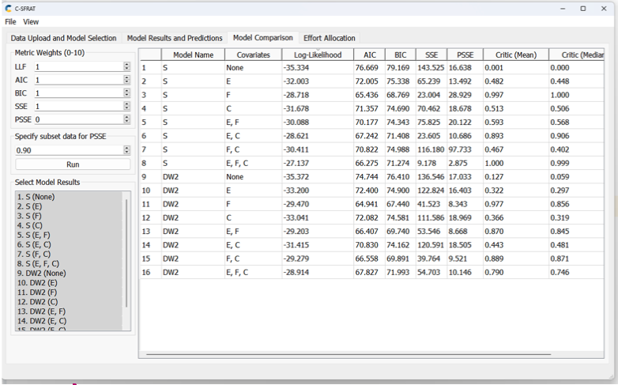
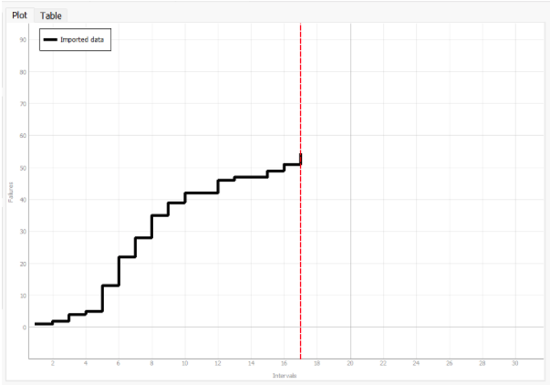
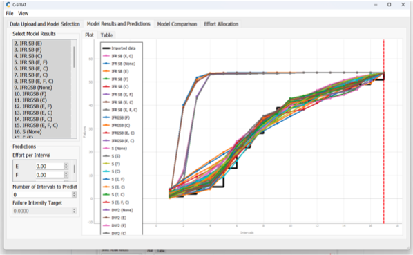
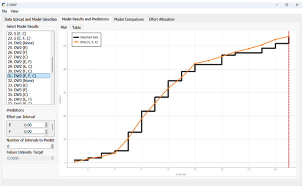
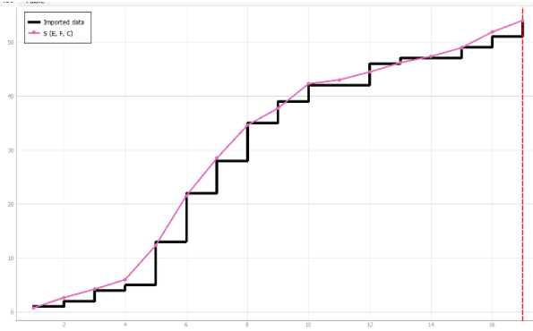
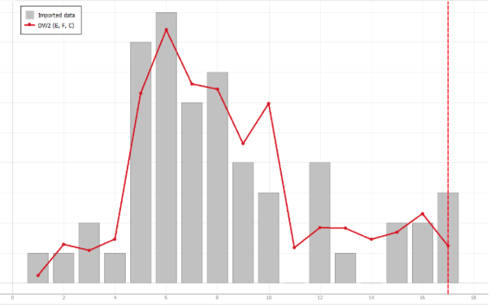
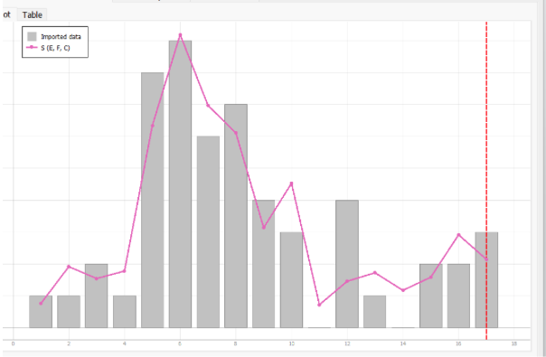
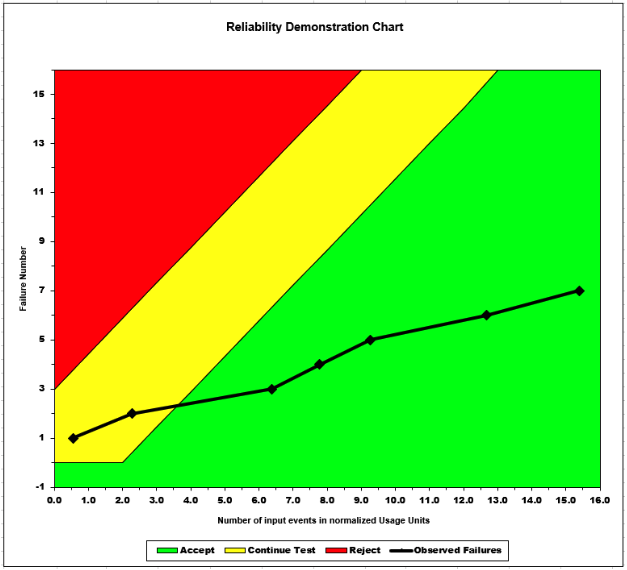
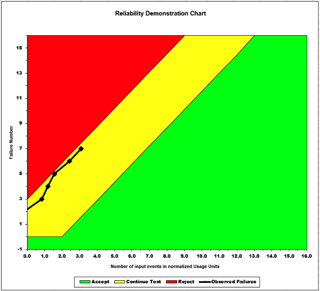

**SENG 438- Software Testing, Reliability, and Quality**

**Lab. Report \#5 – Software Reliability Assessment**

| Group \#:       |   |
|-----------------|---|
| Student Names:  | Carter Boucher  |
|                 | Ayo Olabode  |
|                 | Maheen Hossain  |
|                 | Jason Wu  |

# Introduction

# 

# Assessment Using Reliability Growth Testing 

By analyzing the table, we can observe that the log-likelihood, essentially a test for comparing two models, emphasizes the improvement in terms of likelihood value. From the log-likelihood values, we were able to deduce that the S(E,F,C) and DW2(E,F,C) were the two models that most closely matched our failure data set. S(E,F,C) represents S distribution model, while DW2 stands for Discrete Weibull (Type II).

## MVF Graph of Imported Data

## MVF Graph all Models with Imported Data

## MVF Graph of DW3(E, F, C) with Imorted Data

## MVF Graph of S(E, F, C) with Imorted Data

## Intensity Graph of DW3(E, F, C) with Imorted Data

## Intensity Graph of S(E, F, C) with Imorted Data

## Intensity Graph of DW3 and S

# Assessment Using Reliability Demonstration Chart 

## 3 plots for MTTFmin, twice and half of it for your test data
## MTTFmin = 36 (Predicted mean time of 36 time units to a failure)

## Half of MTTFmin =  18 (Predicted mean time of 18 time units to a failure)

## Twice MTTFmin = 72  (Predicted mean time of 72 time units to a failure)

__Explain your evaluation and justification of how you decide the MTTFmin__

The MTTFmin is the minimum value that the system under test (SUT) becomes acceptable. In relation to the reliability demo chart, the horizontal axis is the normalized failure time, which is Failure TimeMTTF . For this lab, the MTTFmin was determined by first inputting the failure data, which was the failure number and failure time from the given datasets, into the input Excel cells. After viewing the resulting observed failure points in the chart, we adjusted the scale of the Failure Intensity Objective in the tool, which is the targeted acceptable number of failures per number of input events that can also be viewed as the targeted MTTF. Adjusting the scale based on the failure data would result in the observed failures changing to point towards different confidence values. Therefore, we experimented with values that would cause the failure points to extend to the boundary of the yellow and green region. The value used as the FIO would then be the MTTFmin, because it is the value where the SUT reaches acceptable range with the lowest MTTF, and any further would cause the tool to advise to continue testing.

__A discussion on the advantages and disadvantages of RDC__

RDC is primarily used in situations where the failure data is relatively small, and only has a few failures. The failure times must also be provided, so that the system reliability trend can be determined from failure metrics. When all of these factors are met, RDC is a useful way to track the reliability of software systems over time, while being relatively time and cost efficient. It can also be used to find trends in failure rates, which can help predict future possible failures in a system. However, if these specific criteria are not met, RDC cannot provide accurate or useful metrics for software testing. Therefore, for larger and more complex software systems that have high failure rates, RDC would not perform well and other software testing tools should be used instead. Another disadvantage of RDC is that it cannot be used to calculate the exact quantitative value for the reliability of the SUT, only indicating if it is acceptable or not.

# Comparison of Results

# Discussion on Similarity and Differences of the Two Techniques

## 

## When to use RGT vs. RDC

Reliability Growth Testing (RGT) is performed to assess the current level of reliability, identify and eliminate faults, and predict future reliability. Progress towards achieving reliability goals is measured by comparing reliability figures with intermediate objectives, allowing resources to be allocated efficiently. In the event of a failure, corrective action is taken to address the issue.

At the end of the growth testing period, the Reliability Demonstration Chart (RDC) is used to verify that a specific reliability level (FIO) has been reached. During this phase, the software code is locked down.

## Similarities:

- Both techniques relied on failure times and aimed to determine the target failure rate (MTTF).
- Both techniques utilized the same dataset of failures as input.
- Both techniques evaluated the same system.

## Differences:

- The techniques generated distinct reliability plots as they analyzed the data differently.
- Reliability growth analysis employed both failure count and inter-failure times
- RDC solely focused on inter-failure times.

# How the team work/effort was divided and managed

# Difficulties encountered, challenges overcome, and lessons learned
We encountered difficulties with Mac OS and the software within the lab. This only caused a problem while we were working at school because 3 of the 4 members had mac laptops. We had windows computers at home so we were able to complete the lab then. It was also hard at the beginning understanding the programs and how to use them, we were able to figure it out with time.

# Comments/feedback on the lab itself
I think it would have been very helpful if there were more instructions on how to use the software, it was hard for us at the beginning and it took quite a bit of time to figure out how it works. Also it would help if the software worked on Mac OS.