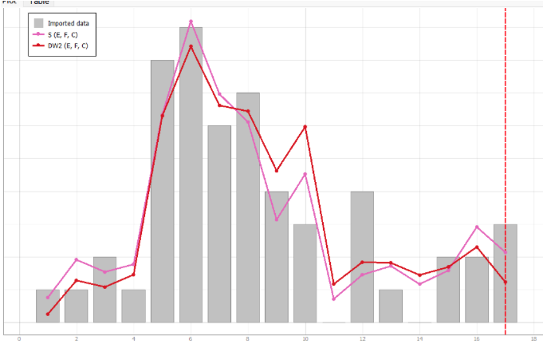

**SENG 438- Software Testing, Reliability, and Quality**

**Lab. Report \#5 – Software Reliability Assessment**

| Group \#:       |   |
|-----------------|---|
| Student Names:  | Carter Boucher  |
|                 | Ayo Olabode  |
|                 | Maheen Hossain  |
|                 | Jason Wu  |

# Introduction

# 

# Assessment Using Reliability Growth Testing 

By analyzing the table, we can observe that the log-likelihood, essentially a test for comparing two models, emphasizes the improvement in terms of likelihood value. From the log-likelihood values, we were able to deduce that the S(E,F,C) and DW2(E,F,C) were the two models that most closely matched our failure data set. S(E,F,C) represents S distribution model, while DW2 stands for Discrete Weibull (Type II).

## MVF Graph of Imported Data

## MVF Graph all Models with Imported Data

## MVF Graph of DW3(E, F, C) with Imorted Data

## MVF Graph of S(E, F, C) with Imorted Data

## Intensity Graph of DW3(E, F, C) with Imorted Data

## Intensity Graph of S(E, F, C) with Imorted Data

## Intensity Graph of DW3 and S

# Assessment Using Reliability Demonstration Chart 

# 

# Comparison of Results

# Discussion on Similarity and Differences of the Two Techniques

## 

## When to use RGT vs. RDC

Reliability Growth Testing (RGT) is performed to assess the current level of reliability, identify and eliminate faults, and predict future reliability. Progress towards achieving reliability goals is measured by comparing reliability figures with intermediate objectives, allowing resources to be allocated efficiently. In the event of a failure, corrective action is taken to address the issue.

At the end of the growth testing period, the Reliability Demonstration Chart (RDC) is used to verify that a specific reliability level (FIO) has been reached. During this phase, the software code is locked down.

## Similarities:

- Both techniques relied on failure times and aimed to determine the target failure rate (MTTF).
- Both techniques utilized the same dataset of failures as input.
- Both techniques evaluated the same system.

## Differences:

- The techniques generated distinct reliability plots as they analyzed the data differently.
- Reliability growth analysis employed both failure count and inter-failure times
- RDC solely focused on inter-failure times.

# How the team work/effort was divided and managed

# Difficulties encountered, challenges overcome, and lessons learned
We encountered difficulties with Mac OS and the software within the lab. This only caused a problem while we were working at school because 3 of the 4 members had mac laptops. We had windows computers at home so we were able to complete the lab then. It was also hard at the beginning understanding the programs and how to use them, we were able to figure it out with time.

# Comments/feedback on the lab itself
I think it would have been very helpful if there were more instructions on how to use the software, it was hard for us at the beginning and it took quite a bit of time to figure out how it works. Also it would help if the software worked on Mac OS.